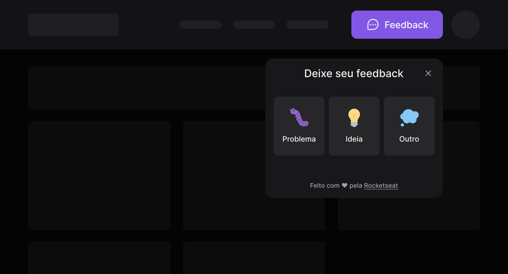

<p align="center">
  
</p>

<h1 align="center">
  Feedback Widget
</h1>

<p align="center">
  

  

  <a href="https://github.com/Jumori/feedget/commits/master">
    
  </a>
</p>

Tabela de conteúdos
=================
<!--ts-->
   * [Sobre o projeto](#-sobre-o-projeto)
   * [Layout](#-layout)
   * [Como executar o projeto](#-como-executar-o-projeto)
     * [Pré-requisitos](#pré-requisitos)
     * [Rodando a aplicação](#rodando-a-aplicação-mobile)
   * [Tecnologias](#-tecnologias)
   * [Autora](#-autora)
   * [Licença](#user-content--licença)
<!--te-->


## 💻 Sobre o projeto

Feedback Widget - O widget para feedback de usuários da sua aplicação!

Entenda melhor o que os seus usuários pensam sobre sua aplicação web ou mobile com o Feedback Widget!

## 🎨 Layout

O layout da aplicação está disponível no Figma:

<a href="https://www.figma.com/file/0EE0HrWV8NLILbF3yIAYdJ/Feedback-Widget-Community">
  
</a>

## 🚀 Como executar o projeto

Esta aplicação conta com três partes: frontend web, mobile e backend.

Neste diretório estaremos lidando com a parte do frontend web.

### Pré-requisitos

Antes de começar, você vai precisar ter instalado em sua máquina as seguintes ferramentas:
[Git](https://git-scm.com), [Node.js](https://nodejs.org/en/), [Yarn](https://yarnpkg.com/)


### Rodando a aplicação web

```bash

# Clone este repositório
$ git clone git@github.com:Jumori/feedget.git

# Acesse a pasta do projeto no seu terminal/cmd
$ cd web/feedget

# Instale as dependências
$ yarn install

# Inicie a aplicação no ambiente de desenvolvimento
$ yarn dev

```

## 🛠 Tecnologias

As seguintes ferramentas foram usadas na construção do projeto:

#### **Frontend Web**  ([React](https://reactjs.org/)  +  [TypeScript](https://www.typescriptlang.org/))

-   **[Vite](https://vitejs.dev/)**
-   **[Tailwind](https://tailwindcss.com/)**
-   **[Headless UI](https://headlessui.dev/)**

> Veja o arquivo  [package.json](https://github.com/Jumori/feedget/blob/master/web/feedget/package.json)


## 🦸 Autora

<a href="https://github.com/Jumori">
 
 <br />
 <sub><b>Juliana Morikoshi</b></sub></a>
 <br />

[](https://www.linkedin.com/in/julianamorikoshi/)
[](mailto:julianamorikoshi@gmail.com)

---

## 📝 Licença

Este projeto esta sob a licença [MIT](../../LICENSE).

Feito com ❤️ por Juliana Morikoshi 👋 [Entre em contato!](https://www.linkedin.com/in/julianamorikoshi/)
